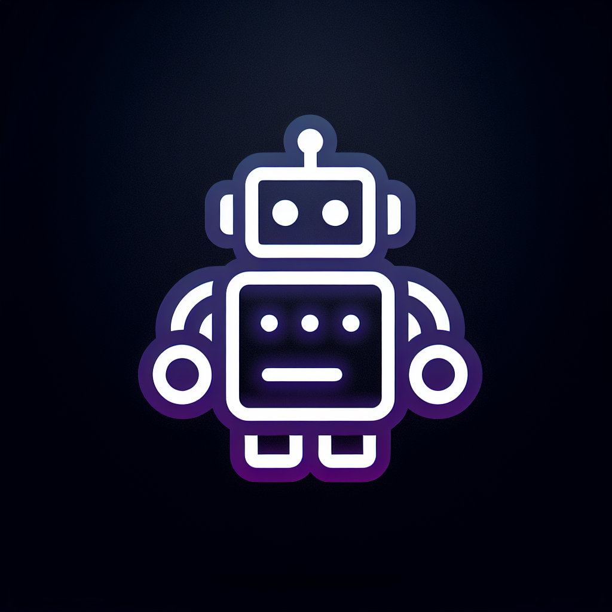

# Power System Database Assistant

A versatile LangGraph-powered chatbot that connects to different database types (GraphDB, PostgreSQL, AWS RDS, AWS Neptune) for querying power system equipment data.

## Features

- **Multi-Database Support**: Compatible with both graph databases (GraphDB, AWS Neptune) and relational databases (PostgreSQL, AWS RDS)
- **Advanced LLM Integration**: 
  - Auto model selection based on query complexity
  - Manual model selection (Gemini, Llama3)
  - Optimized query generation
- **Sophisticated Query Processing**:
  - Automatic conversion from natural language to appropriate query language (SPARQL/SQL)
  - Query validation and optimization
  - Result caching for better performance
- **Power System Domain Specialized**:
  - Built-in knowledge of electrical grid equipment
  - Specialized schema for transformers, lines, substations, etc.
- **Interactive Web Interface**:
  - Simple and intuitive chat interface
  - Database and model selection options
  - Connection configuration capabilities

## Technical Architecture

The application follows a multi-stage processing pipeline powered by LangGraph:

1. **Model Selection**: Chooses between Gemini and Llama3 models based on user preference or query complexity
2. **Query Optimization**: Converts natural language to the appropriate query language
3. **Query Validation**: Checks for syntax errors and semantic correctness
4. **Query Execution**: Executes the validated query against the selected database
5. **Response Generation**: Creates a formatted response from the query results

## Database Schema

The system supports both relational and graph database schemas for power system equipment:

### Relational Schema (PostgreSQL/AWS RDS)
- Equipment (id, name, description, type)
- Transformer (id, name, apparent_power, voltage_level, status)
- Terminal (id, name, connected)
- Substation (id, name, latitude, longitude)
- Line (id, name, length, voltage_level)
- Various relationship tables (EquipmentSubstation, TerminalConnection)

### Graph Schema (GraphDB/AWS Neptune)
- Similar entities as vertices with relationships defined as edges
- Supports both SPARQL and Gremlin query languages for AWS Neptune

## Setup and Installation

See the [guide.txt](guide.txt) file for detailed installation instructions.

### Quick Start

1. Clone this repository
2. Install dependencies (see `install_deps.txt` for details)
3. Configure your `.env` file with API keys and database connection (see `.env.example`)
4. Run the application: `python main.py` or `gunicorn --bind 0.0.0.0:5000 --reuse-port --reload main:app`
5. Open [http://localhost:5000](http://localhost:5000) in your browser

## Usage Examples

The system can answer a wide range of questions about power system equipment:

- "What are all the transformers with voltage level above 300kV?"
- "Show me the substations located in the northern region"
- "Which terminal connects transformer TX001 to line L1?"
- "List all equipment at the Main Substation"

## API Keys and Secrets

This project requires:
- Google API key for Gemini model access
- GROQ API key for Llama3 model access (optional)
- Database credentials if connecting to real databases

## Contributors

- [Your Name/Team]

## License

[Your License Information]